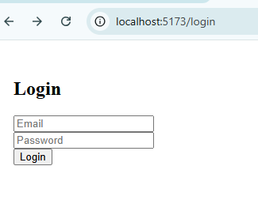
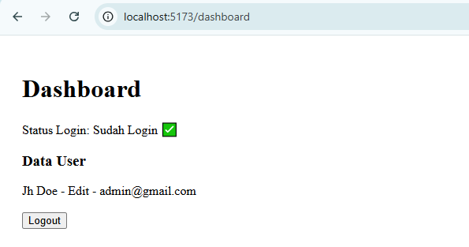
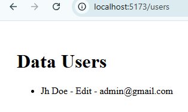
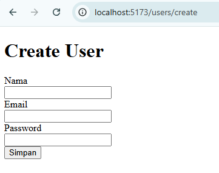
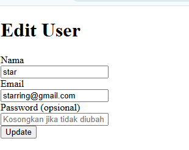
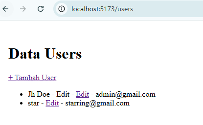
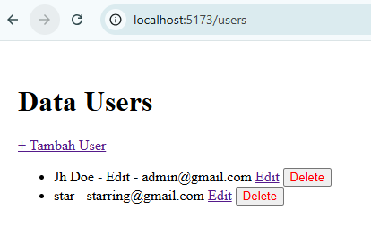
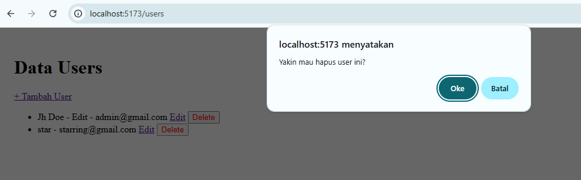
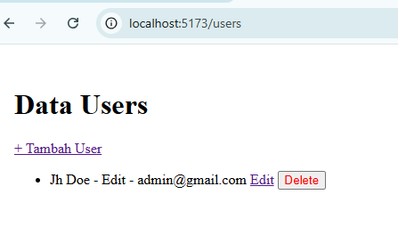

# Praktikum 10–16 (Authentication & CRUD User)

## Identitas
Nama  : Marsya Anastasya 
NPM   : 230660221100 
Kelas : SI-VB

---

## Deskripsi
Project ini merupakan hasil Praktikum 10–16 yang membahas implementasi
Authentication dan CRUD User menggunakan teknologi backend dan frontend modern.

Sistem menggunakan **JWT (JSON Web Token)** untuk proses login dan proteksi route,
serta **React Context API** untuk manajemen autentikasi di frontend.

---

## Fitur Aplikasi
- Login dan Logout
- Autentikasi menggunakan JWT
- Penyimpanan token di Local Storage
- Proteksi halaman (Dashboard & Users)
- CRUD User:
  - Create User
  - Read User
  - Update User
  - Delete User

---

## Teknologi yang Digunakan

### Backend
- Node.js
- Express.js
- Prisma ORM
- MySQL
- JSON Web Token (JWT)

### Frontend
- React.js (Vite)
- React Router DOM
- Axios
- Context API

---

## Cara Menjalankan Project

### 1. Menjalankan Backend
```bash
cd backend-express
npx nodemon index.js
```

Server backend berjalan di:
```
http://localhost:3000
```

---

### 2. Menjalankan Frontend
```bash
cd frontend
npm run dev
```

Frontend berjalan di:
```
http://localhost:5173
```

---

## Screenshot Hasil Aplikasi

### 1. Login Berhasil


### 2. Dashboard


### 3. Data Users (Read)


### 4. Create User


### 5. Edit User
  


### 6. Delete User
  
  


---

## Kesimpulan
Pada praktikum ini berhasil dibuat sistem authentication dan CRUD user
menggunakan JWT dan React Context API.  
Semua fitur berjalan dengan baik sesuai dengan modul praktikum.
